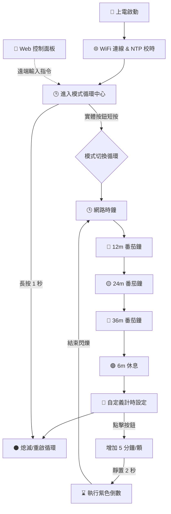

# ESP32-C3 IoT 終極番茄時鐘站 (Pomo-Clock v18.1)

[繁體中文](#繁體中文) | [English](#english) | [日本語](#日本語) | [Русский](#русский) | [Italiano](#italiano) | [Français](#français)

---

## 🇹🇼 繁體中文
這是一個專為深層專注與高效時間管理設計的 **ESP32-C3** 物聯網裝置。

### 🌟 核心特色
*   **🕒 網路精準時鐘**：透過 **`pool.ntp.org`** 自動對時，白色(時)、青色(分)、紅色(秒)三針優雅呈現。
*   **📱 煥新 Web UI**：全新 Dark Mode 深色介面，支援即時倒數進度條與遠端設定。
*   **💜 動態計時顯示**：自定義模式下 LED 會以「一閃一閃」的呼吸感運作。

### 📊 系統邏輯流程圖 (System Flowchart)

### 📖 使用情境 (Use Cases)
*   **💻 程式開發/讀書專注**：利用固定 12/24/36 分鐘番茄鐘，進入全心投入狀態。
*   **🍵 生活計時**：泡茶 (3min)、泡麵 (5min)、午睡 (20min) 均可透過快速設定。
*   **🛌 夜間時鐘**：極低亮度設計，放在床頭作為時鐘使用也不影響睡眠。

### 🛠️ 硬體接腳說明 (Hardware Pinout)
*   **LED 數據線 (DIN)**: **GPIO 10**
*   **實體按鈕 (BOOT)**: **GPIO 9**
*   **電源**: 5V DC 至 VCC/GND

### 🔄 操作流程說明 (Workflows)
1. **實體按鈕**：短按切換模式。在紫色設定模式點擊增加時間 (+5min)，靜置 2 秒啟動。
2. **網頁控制**：連線 IP 地址遠端操作模式切換與自定義計時（支援 1~999 分鐘）。
3. **時鐘同步**：向 `pool.ntp.org` 同步 GMT+8 時間。

---

## 🇺🇸 English
Ultimate **ESP32-C3** IoT timer station for focus and time management.

### 🌟 Key Features
*   **🕒 NTP Network Clock**: Auto-sync via **`pool.ntp.org`** with intuitive 3-hand LED display.
*   **� Modern Web UI**: Dark Mode dashboard with real-time progress bars.
*   **💜 Dynamic Visuals**: Smooth blinking effect in custom timer mode.

### 📖 Use Cases
*   **💻 Focus**: Fixed 12/24/36m Pomodoro for programming or studying.
*   **🍵 Life**: Quick timers for cooking, tea, or power naps.
*   **🛌 Bedside**: Ultra-low brightness (value 1) ideal as a non-disturbing night clock.

### �️ Hardware Pinout
*   **LED Data (DIN)**: GPIO 10
*   **Button (BOOT)**: GPIO 9
*   **Power**: 5V DC

### �🔄 Workflows
1. **Manual Button**: Click to cycle modes. In **Purple Mode**, click to add 5min per LED, wait 2s to start.
2. **Web Dashboard**: Control remotely via browser. Supports custom input (1-999 min).
3. **Sync Logic**: Synchronizes with `pool.ntp.org` for accurate local time.

---

## 🇯🇵 日本語
集中力向上と時間管理のための **ESP32-C3** IoT デバイスです。

### 🌟 主な機能
*   **🕒 NTP 時計**: **`pool.ntp.org`** による自動時刻合わせ機能。
*   **📱 モダンな Web UI**: リアルタイム進捗バー付きダークモードダッシュボード。
*   **💜 動的な点滅**: カスタムタイマーでは LED が点滅し、計時中であることを示します。

### 📖 使用シーン
*   **💻 集中**: 固定 12/24/36 分のポモドーロモード。
*   **🍵 生活**: お茶、カップ麺、昼寝用のクイックタイマー。
*   **🛌 夜間**: 超低輝度設計により、寝室の時計として最適です。

### �️ ハードウェア接続
*   **LED データ (DIN)**: GPIO 10
*   **ボタン (BOOT)**: GPIO 9
*   **電源**: 5V DC

### �🔄 操作フロー
1. **物理ボタン**: クリックでモード切替。紫色モード中にクリックで時間を追加 (+5分)、2秒待つと開始。
2. **Web 制御**: ブラウザからリモート操作可能。任意の分数を入力してタイマーを起動。
3. **時刻同期**: `pool.ntp.org` から GMT+8 の正確な時刻を取得。

---

## 🇷🇺 Русский
Максимальное IoT-устройство на базе **ESP32-C3** для концентрации и тайм-менеджмента.

### 🌟 Особенности
*   **� Часы NTP**: Автоматическая синхронизация через **`pool.ntp.org`**.
*   **📱 Web-интерфейс**: Темная тема с индикатором прогресса в реальном времени.
*   **💜 Динамика**: Эффект мигания для настраиваемого таймера.

### 📖 Использование
*   **💻 Работа**: Фиксированные циклы Помодоро на 12/24/36 мин.
*   **🍵 Быт**: Таймер для чая, лапши или короткого сна.
*   **🛌 Ночь**: Сверхнизкая яркость для использования в спальне.

### 🛠️ Подключение
*   **Данные LED (DIN)**: GPIO 10
*   **Кнопка (BOOT)**: GPIO 9
*   **Питание**: 5В

### 🔄 Процессы
1. **Кнопка**: Нажмите для смены режима. В фиолетовом режиме добавьте время (+5 мин), подождите 2 сек.
2. **Web-панель**: Удаленное управление режимами и ввод произвольного времени.
3. **Синхронизация**: Точное время через `pool.ntp.org`.

---

## 🇮🇹 Italiano
Un dispositivo IoT **ESP32-C3** per la concentrazione profonda e la gestione del tempo.

### 🌟 Caratteristiche
*   **🕒 Orologio NTP**: Sincronizzazione via **`pool.ntp.org`**.
*   **� Web UI Moderna**: Dashboard in Dark Mode con barra di avanzamento.
*   **💜 Visuali Dinamiche**: Effetto lampeggiante per il timer personalizzato.

### 📖 Casi d'Uso
*   **💻 Studio**: Timer Pomodoro fissi (12/24/36m) per lo studio o il lavoro.
*   **🍵 Quotidiano**: Timer rapidi per tè, cucina o riposini.
*   **🛌 Notte**: Luminosità minima perfetta per l'orologio da comodino.

### 🛠️ Hardware
*   **Dati LED (DIN)**: GPIO 10
*   **Pulsante (BOOT)**: GPIO 9
*   **Alimentazione**: 5V

### 🔄 Workflow
1. **Pulsante**: Ciclo modalità. In modalità Viola, aggiungi +5min/LED e attendi 2s per avviare.
2. **Dashboard Web**: Controllo remoto tramite browser con input personalizzato.
3. **Sincronizzazione**: Ora locale precisa via `pool.ntp.org`.

---

## 🇫🇷 Français
L'appareil IoT **ESP32-C3** ultime pour une gestion du temps efficace.

### 🌟 Fonctionnalités
*   **🕒 Horloge NTP**: Synchronisation via **`pool.ntp.org`**.
*   **📱 Interface Web**: Tableau de bord moderne avec barres de progression.
*   **💜 Visuels**: Effet clignotant en mode minuterie personnalisée.

### 📖 Utilisations
*   **💻 Travail**: Modes Pomodoro fixes (12/24/36m).
*   **🍵 Vie quotidienne**: Minuteurs rapides pour la cuisine ou la sieste.
*   **🛌 Nuit**: Luminosità ultra-basse idéale pour une table de chevet.

### 🛠️ Matériel
*   **Données LED (DIN)**: GPIO 10
*   **Bouton (BOOT)**: GPIO 9
*   **Alimentation**: 5V

### 🔄 Flux
1. **Bouton**: Cycle des modes. Mode Violet : cliquez pour ajouter +5 min, attendez 2 s.
2. **Interface Web**: Pilotage à distance et saisie personnalisée (1-999 min).
3. **Synchronisation**: Heure UTC+8 via `pool.ntp.org`.

---
**Version: v18.1 [Documented-World-Edition]**  
*Developed with Antigravity. High-performance time management logic.*
