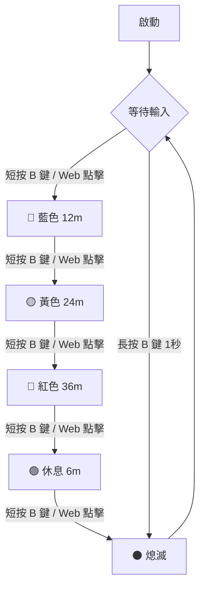

# ESP32-C3 IoT 終極番茄鐘 (Pomo-LED)

這是一個專為深層專注設計的 **ESP32-C3** 物聯網番茄鐘。它將 12 顆 WS2812B 燈環轉化為直覺的時間沙漏，並採用極低亮度設計，確保在夜間或辦公環境中使用完全不刺眼。

## 🚀 核心功能
*   **四段階梯專注模式**：
    *   🔵 **藍色模式 (12m)**：短任務專注。
    *   🟡 **黃色模式 (24m)**：標準番茄鐘。
    *   🔴 **紅色模式 (36m)**：長時深層工作。
    *   🟢 **休息模式 (6m)**：高效休息回血。
*   **極限暗度控制**：亮度鎖定在硬體發光底線 (數值 1)，靜態不閃爍，消除視覺干擾。
*   **實體鍵操作**：按 B 鍵 (BOOT) 循環切換，長按 1 秒立即熄滅。
*   **Web 監控介面**：即時顯示倒數剩餘時間與切換模式。

## 📊 系統邏輯流程

## 🛠️ 安裝說明
1.  **硬體接線**：WS2812B Data 接腳連接至 ESP32-C3 的 **GPIO 10**。
2.  **安全設定**：請參考 `secrets.h.example` 建立 `secrets.h` 並填入 WiFi 資訊。
3.  **上傳程式**：使用 Arduino IDE 開啟 `WIFI_Rainbow_RGB.ino` 並上傳至開發板。

## 📸 操作指南
*   **B 鍵 (GPIO 9)**：實體控制中心。
*   **R 鍵**：系統重啟。
*   **Web 網址**：上傳完成後，請從 Serial Monitor 查看 IP (例如 `http://192.168.x.x`)。

---
**版本：v16.2 [Pomo-ULTRA-LOW]**  
*由 Antigravity 輔助開發，致力於打造最安靜的專注環境。*
