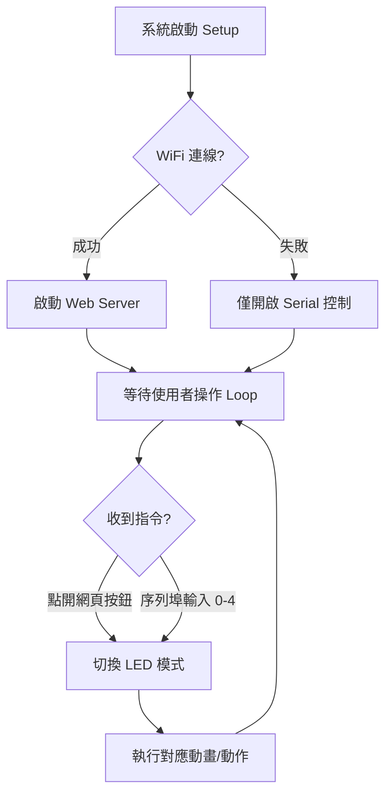

# ESP32-C3 WiFi LED 控制器

這是一個基於 **ESP32-C3** 的物聯網 (IoT) 燈光控制專案，可以透過網頁瀏覽器遠端切換 WS2812B (Rainbow Ring) 的多種動態效果。

## 🚀 功能特點
* **網頁控制專屬介面**：美觀的深色系 Web UI。
* **五種燈光模式**：全部點亮、全部熄滅、動態彩虹、順時針跑馬燈、逆時針跑馬燈。
* **安全保護**：將 WiFi 憑據隔離在 `secrets.h` 中，防止外洩至代碼倉庫。
* **非阻塞設計**：使用 `millis()` 控制動畫，網頁反應即時不卡頓。

## 📊 系統運作流程圖

## 🛠️ 安裝與開發環境
1. **硬體**：使用 ESP32-C3 開發板 + WS2812B 12 顆燈環。
2. **所需函式庫**：
   - `Freenove_WS2812_Lib_for_ESP32` (請於 Arduino IDE 函式庫管理員搜尋安裝)。
3. **安全設定**：
   - 將目錄下的 `secrets.h.example` 重新命名為 `secrets.h`。
   - 在 `secrets.h` 中填入您的 WiFi SSID 與密碼。

## 📸 網頁控制介面預覽
連線成功後，請在瀏覽器輸入 Serial Monitor 顯示的 IP 位址（例如 `http://192.168.x.x`）。

---
**版本：v15.2 [IoT LED Controller]**  
*由 Antigravity 輔助開發*
