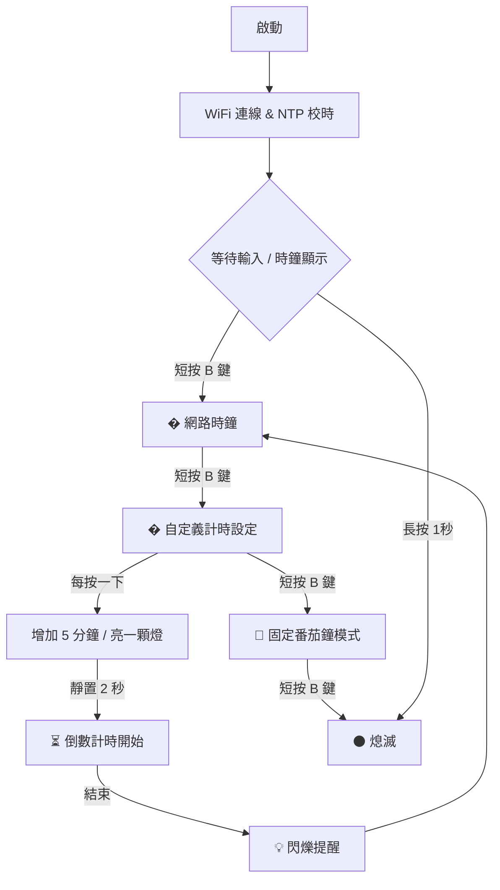

# ESP32-C3 IoT 終極番茄計時器 & 網路時鐘 (Pomo-Clock v17.0)

這是一個專為深層專注與時間管理設計的 **ESP32-C3** 物聯網裝置。它將 12 顆 WS2812B 燈環轉化為直覺的「時間沙漏」與「網路同步時鐘」，並採用極低亮度設計，確保在任何環境下都能優雅地融入，不造成視覺負擔。

## 🚀 核心功能

*   **🕒 網路同步時鐘 (NTP)**：自動透過 WiFi 校時，以 12 顆 LED 顯示小時、分鐘與秒。
*   **💜 自定義計時器 (紫色模式)**：**全新功能！** 無需手機，直接點擊實體按鈕設定分鐘數 (5~60分鐘)。
*   **🍅 階梯式番茄鐘**：內建四種預設模式：
    *   🔵 **藍色 (12m)**：短任務專注。
    *   🟡 **黃色 (24m)**：標準番茄鐘。
    *   🔴 **紅色 (36m)**：深層工作。
    *   🟢 **休息 (6m)**：定時休息。
*   **🌙 極限暗度控制**：亮度鎖定在硬體發光底線 (數值 1)，靜態不閃爍，保護眼睛且低干擾。
*   **📱 Web 智慧介面**：即時查看當前模式、數位時間，並可遠端控制。

## 📸 實體按鈕操作手冊 (GPIO 9)

| 操作方式 | 功能描述 |
| :--- | :--- |
| **短按 (模式切換)** | 依序切換：關閉 -> **時鐘** -> **自定義計時(紫色)** -> 藍色 -> 黃色 -> 紅色 -> 休息 -> 關閉 |
| **紫色模式設定** | 進入紫色模式後，**每按一下增加 5 分鐘** (點亮一顆燈)。 |
| **啟動倒數** | 在紫色模式設定完時間後，**靜置 2 秒**，系統會閃爍並自動開始倒數。 |
| **長按 (1秒)** | 無論在任何模式，立即熄滅 LED 並進入省電狀態。 |

## 📊 系統邏輯流程

## 🛠️ 安裝與開發
1.  **硬體接線**：WS2812B Data 接腳連接至 ESP32-C3 的 **GPIO 10**。
2.  **安全設定**：複製 `secrets.h.example` 為 `secrets.h` 並填入您的 WiFi `SSID` 與 `Password`。
3.  **軟體庫需求**：
    *   `Freenove_WS2812_Lib_for_ESP32`
    *   `WiFi.h`, `WebServer.h`, `time.h` (內建)

---
**版本：v17.0 [Button-Timer-NTP]**  
*由 Antigravity 輔助開發，致力於打造最極致的時間管理體驗。*
