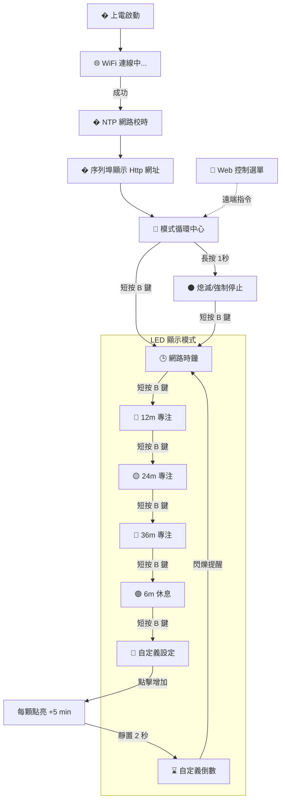

# ESP32-C3 IoT 終極番茄時鐘站 (Pomo-Clock v18.1)

這是一個專為深層專注與高效時間管理設計的 **ESP32-C3** 物聯網裝置。它完美結合了 12 顆 WS2812B 燈環的視覺美學、網路即時校時時鐘、以及靈活的計時器功能。

## 🌟 核心特色
*   **🕒 網路精準時鐘**：透過 NTP 自動對時，白色(時)、青色(分)、紅色(秒)三針優雅呈現。
*   **🌓 極致視覺舒適**：亮度設定為硬體極限值 `1`，無論白天或黑夜都不刺眼，營造寧靜的專注氛圍。
*   **📱 煥新 Web UI**：全新 Dark Mode 深色介面，支援即時倒數進度條與遠端自定義分鐘設定。
*   **💜 動態計時顯示**：自定義模式下 LED 會以「一閃一閃」的呼吸感運作，區別於恆亮的時鐘模式。
*   **📡 完整日誌監控**：Serial Monitor 提供顯眼的 Web 網址連結與即時狀態回饋。

## 📊 系統運作流程圖

## � 操作指南 (實體按鈕 GPIO 9)

| 操作動作 | 對應功能 | LED 視覺回饋 |
| :--- | :--- | :--- |
| **短按一下** | 切換到下一種模式 | 變換顏色或模式 |
| **進入紫色模式** | 進入「自定義計時」設定 | 最後一顆紫色燈微弱閃爍 |
| **紫色模式連續點擊** | 增加計時時長 | 每多一顆燈 = 增加 5 分鐘 |
| **靜置 2 秒** | 確認並啟動紫色倒數 | 全部紫色燈閃爍後開始 |
| **長按 1 秒** | 立即強制熄滅所有燈光 | LED 全部熄滅 |

## 🛠️ 開發者資訊
*   **Debug 連接**：請開啟序列埠監控視窗 (Baud: **115200**)。
*   **接線參考**：LED 訊號腳 DIN -> **GPIO 10**。
*   **安全性**：修改 `secrets.h` 以配置 WiFi 權限。

---
**版本：v18.1 [Next-Gen-UX]**  
*由 Antigravity 輔助開發，致力於打造最極致的桌面工作伴侶。*
